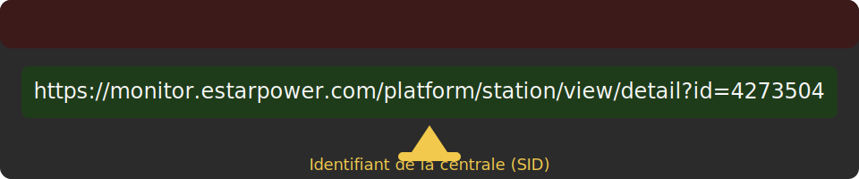

# Plugin Estar Energy pour Jeedom

Le plugin **Estar Energy** permet de récupérer automatiquement les données de production et de consommation publiées sur le portail Estar Power. Il se connecte périodiquement au site officiel (aucune API publique n'est disponible) pour mettre à jour vos équipements Jeedom avec les informations suivantes : puissance photovoltaïque, consommation, échanges réseau, production journalière/mensuelle/annuelle, compensation carbone, etc.

## Fonctionnement

* Authentification : saisissez votre identifiant et votre mot de passe Estar Power dans la configuration du plugin.
* Équipement : pour chaque centrale à superviser, créez un équipement et indiquez son identifiant "SID" (visible dans l'URL du portail Estar Power).

* Actualisation : le plugin déclenche automatiquement la collecte des données toutes les 5 minutes afin de respecter les limitations du portail Estar Power. Une commande action `Actualiser` permet également de lancer manuellement la synchronisation à tout moment.

## Commandes créées

Chaque équipement met à disposition les commandes infos suivantes :

| Commande | Description |
| --- | --- |
| `Pv_power` | Puissance instantanée produite par les panneaux (W) |
| `Load_power` | Puissance instantanée consommée par l'installation (W) |
| `Grid_power` | Puissance instantanée échangée avec le réseau (W) |
| `meter_b_in_eq` | Énergie importée depuis le réseau (Wh) |
| `meter_b_out_eq` | Énergie exportée vers le réseau (Wh) |
| `self_eq` | Autoconsommation/autoproduction (Wh) |
| `today_eq` | Production du jour (Wh) |
| `month_eq` | Production du mois (Wh) |
| `year_eq` | Production de l'année (Wh) |
| `total_eq` | Production totale (Wh) |
| `plant_tree` | Nombre d'arbres compensés |
| `co2_emission_reduction` | Réduction estimée des émissions de CO₂ (kg) |

## Prérequis

* Jeedom v4.2 ou supérieure.
* Compte utilisateur actif sur le portail Estar Power.

## Notes

* Les identifiants saisis sont utilisés exclusivement pour récupérer un jeton d'accès auprès du portail Estar Power. Le jeton est conservé temporairement en cache et renouvelé automatiquement lorsqu'il expire.
* Le plugin n'a pas besoin de dépendances ni de démon supplémentaire.
