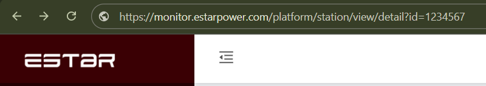

# Plugin EstarEnergy

Bienvenue dans la documentation du plugin **EstarEnergy** pour **Jeedom**.

Cette page présente les informations générales du plugin. Pour des guides détaillés concernant l'installation, la configuration et l'utilisation, référez-vous à la documentation officielle disponible sur le site de Jeedom.

* [Documentation du plugin EstarEnergy](https://doc.jeedom.com/fr_FR/plugins/programming/estarenergy) : Description complète du plugin.

* [Fichier info.json](https://doc.jeedom.com/fr_FR/dev/structure_info_json) : Détails sur la structure du fichier **info.json** utilisé par EstarEnergy.

* [Icône du plugin](https://doc.jeedom.com/fr_FR/dev/Icone_de_plugin) : Rappels sur la création d'une icône adaptée pour EstarEnergy.

* [Widget du plugin](https://doc.jeedom.com/fr_FR/dev/widget_plugin) : Informations pour créer des widgets personnalisés compatibles avec EstarEnergy.

* [Documentation du plugin](https://doc.jeedom.com/fr_FR/dev/documentation_plugin) : Conseils pour maintenir une documentation complète du plugin.

* [Publication du plugin](https://doc.jeedom.com/fr_FR/dev/publication_plugin) : Prérequis pour la publication du plugin EstarEnergy.

## Renseigner l'identifiant de la centrale

Chaque équipement doit être rattaché à une centrale Estar. L'identifiant est visible dans l'URL du portail de supervision après `detail-id=` comme illustré ci-dessous.

Reportez la valeur mise en évidence dans le champ **ID de la centrale** de la fiche équipement du plugin.
