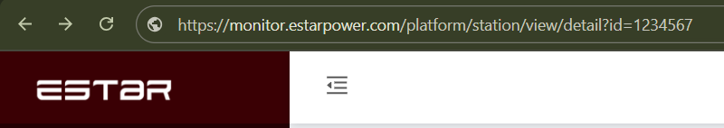

# Plugin EstarEnergy

Bienvenue dans la documentation du plugin **EstarEnergy** pour **Jeedom**.

Cette page présente les informations générales du plugin. Pour des guides détaillés concernant l'installation, la configuration et l'utilisation, référez-vous à la documentation officielle disponible sur le site de Jeedom.

* [Documentation du plugin EstarEnergy](https://doc.jeedom.com/fr_FR/plugins/programming/estarenergy) : Description complète du plugin.

* [Fichier info.json](https://doc.jeedom.com/fr_FR/dev/structure_info_json) : Détails sur la structure du fichier **info.json** utilisé par EstarEnergy.

* [Icône du plugin](https://doc.jeedom.com/fr_FR/dev/Icone_de_plugin) : Rappels sur la création d'une icône adaptée pour EstarEnergy.

* [Widget du plugin](https://doc.jeedom.com/fr_FR/dev/widget_plugin) : Informations pour créer des widgets personnalisés compatibles avec EstarEnergy.

* [Documentation du plugin](https://doc.jeedom.com/fr_FR/dev/documentation_plugin) : Conseils pour maintenir une documentation complète du plugin.

* [Publication du plugin](https://doc.jeedom.com/fr_FR/dev/publication_plugin) : Prérequis pour la publication du plugin EstarEnergy.

## Renseigner l'identifiant de la centrale

Chaque équipement doit être rattaché à une centrale Estar. L'identifiant est visible dans l'URL du portail de supervision après `detail-id=` comme illustré ci-dessous.

Reportez la valeur mise en évidence dans le champ **ID de la centrale** de la fiche équipement du plugin.

## Activer la récupération des données modules (branche beta)

La branche beta du plugin ajoute une requête vers l'API `https://neapi.hoymiles.com/pvm-data/api/0/module/data/down_module_day_data` pour rapatrier les données journalières détaillées des micro-onduleurs Hoymiles.

1. Renseignez le champ **Numéro de série du module** dans la configuration de l'équipement (onglet *Paramètres spécifiques*).
2. Le plugin réutilise le jeton d'authentification Estar pour appeler l'API Hoymiles avec le corps JSON `{ "date": "AAAA-MM-JJ", "sn": "<votre_n°_de_série>" }`.
3. La réponse (gzip/Protobuf ou JSON) est automatiquement décodée et déposée dans la commande info `module_day_data` (non historisée) au format JSON.
4. Vous pouvez ensuite exploiter cette donnée via des scénarios ou des scripts tiers (ex. parsing des créneaux de 5 minutes).

> Remarque : si la réponse est vide ou illisible, vérifiez le numéro de série et la validité du token. Les formats Protobuf minimaux sont parcourus pour extraire la date, la liste des créneaux horaires (`time_slots`) et les séries numériques associées.
